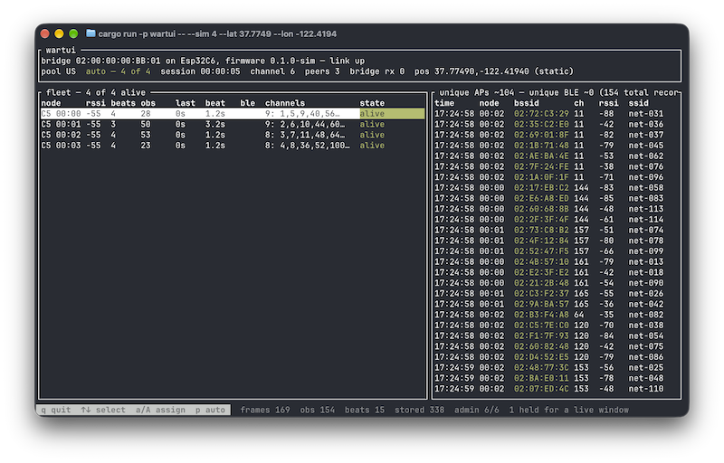

# wartui

A terminal-based fleet controller for ESP32-C5 and ESP32-C6 wardriving nodes.



The nodes talk [ESP-NOW](https://www.espressif.com/en/solutions/low-power-solutions/esp-now), which
a laptop (generally) cannot speak, so wartui drives a USB-attached ESP32 as a radio bridge. It owns
the node table, issues channel assignments, and collects every observation the fleet produces.

The nodes run `firmware/node` and the dongle runs `firmware/bridge`, both in this repository. The
bridge may be a C5 or a C6. It parks on the 2.4 GHz channel 6 for control messages, and never needs
5 GHz. The nodes can also be C5s or C6s, though only the C5s support the 5 GHz band. C6 support is
included because I had both sitting around, and the firmware toolchain is the same.

## History

**tl;dr - the initial ESP32 firmware and wire format is from JustCallMeKoko's
[ESP32DualBandWardriver](https://github.com/justcallmekoko/ESP32DualBandWardriver) project. Support
his work by [buying real hardware](https://justcallmekokollc.com/)!**

After purchasing a C5 Wardriver from JustCallMeKoko, I started looking into its open firmware. I had
some ideas around reducing interference between nodes by reducing the tx power, and what started
with some lightly modified firmware ended up as an entirely separate project.

I wanted a way to motivate myself to relearn Rust, and a fun little TUI sounded like just the
ticket. I hope you enjoy what I've built, modify it, and share with others!

## Running it

### Simulated

No hardware needed — the simulator runs a fake fleet on a fake clock:

```sh
cargo run -p wartui -- --sim 3 --lat 37.7749 --lon -122.4194
```

The simulated nodes model the parts of the firmware that matter: they park doing nothing until
assigned, adopt an assignment only when its epoch differs, dedup through the firmware's own ring,
and sweep — and so heartbeat — proportionally to how many channels they hold. `--sim-c6 N` makes
that many of them ESP32-C6s, counting from the end of the fleet, which is how to put a mixed fleet
in front of the planner without two kinds of board on the desk.

### On real hardware

To use wartui, install it so the binary is on `PATH`:

```sh
cargo install --path crates/wartui
```

With a bridge plugged in, `run` is the default and the subcommand can be left off:

```sh
wartui run --db tonight.db --lat 37.7749 --lon -122.4194
wartui export --db tonight.db --wigle tonight.csv
```

`q` stops a capture, committing the last batch and closing out the session. The store is the system
of record and the CSV is a view over it, re-runnable against a finished session or one still going.

```sh
wartui ports      # which serial devices look like an Espressif board
wartui status     # is the link alive, is anything being dropped
wartui sniff      # every frame the fleet sends, decoded
wartui reset      # reboot a bridge that has stopped answering
```

## Subprojects

| Path                                                     | What it is                                                                                                    |
| -------------------------------------------------------- | ------------------------------------------------------------------------------------------------------------- |
| [`crates/wartui`](crates/wartui/README.md)               | The CLI and the [ratatui](https://ratatui.rs/) UI — **view the linked README for the full operator's manual** |
| `crates/wartui-core`                                     | Headless fleet engine, SQLite store, position, WiGLE export                                                   |
| `crates/wartui-bridge`                                   | Host-side link to the dongle: transport, port discovery, simulator                                            |
| `crates/wartui-proto`                                    | `no_std` wire formats and parsers, shared with both firmwares                                                 |
| [`firmware/bridge`](firmware/bridge/README.md)           | The dongle: COBS framing and `esp-radio` calls, no protocol knowledge                                         |
| [`firmware/node`](firmware/node/README.md)               | The nodes: sniffs, reports, takes assignments                                                                 |
| [`tools/espnow-sniffer`](tools/espnow-sniffer/README.md) | Passive Arduino sniffer for bring-up and frame capture                                                        |
| `tools/beacons`                                          | Turns a monitor-mode capture into fixtures for the beacon parser                                              |

Each firmware is its own workspace — a different target, its own toolchain pin and its own lockfile
— and both take a path dependency up into `crates/wartui-proto`, which is the only thing keeping the
two ends of the wire in step. The library crates have no README of their own; their `//!` module
docs are the detail.

## At the keyboard

| Key               | What it does                                            |
| ----------------- | ------------------------------------------------------- |
| `↑` `↓` / `k` `j` | Move the cursor down the fleet table                    |
| `b`               | Move the Bluetooth scan to it, or take it off the fleet |
| `q`               | Stop, committing the last batch                         |

wartui partitions the channel pool across the fleet without being asked and re-cuts it as the fleet
changes, which is the core's job and the reason this exists. It is the only thing that decides what
a node scans: there is no key and no flag that overrides one node's share.

Nothing goes out at the moment a share changes. A node's radio is away scanning for all but the 100
ms it holds open after its own heartbeat, so the assignment waits for that window — up to about five
seconds on a full sweep of the default pool. The `channels` column reads `1: 1…` until it lands.

`--pool all` is the default: every channel a node can tune, 2.4 GHz 1–13 and all of 5 GHz.
`--pool us` is 2.4 GHz 1–11 and 5 GHz 36–165; `--pool eu` is 2.4 GHz 1–13 and 5 GHz 36–140.

At most one node scans Bluetooth, and by default none does. `b` moves it.

**Fleet states, GPS, channel-pool detail and troubleshooting are in
[`crates/wartui/README.md`](crates/wartui/README.md).**

## Limits

- **Maximum twenty nodes** (`plan::MAX_NODES`) — that is how many peers an ESP-NOW radio holds.
  Above it, capture continues and nothing is dropped, but the planner stops re-cutting and says so.
- **An ESP32-C6 is never dealt a 5 GHz channel.** Its radio is 2.4 GHz only.
- **Channel 14 is in no pool** and is never dealt; `esp-radio` exposes no way to reach it. It's
  Japan-only 802.11b, so should be extremely rare.
- **Plaintext ESP-NOW only**, in both directions. There is no pairing handshake and no key.
- **Every radio transmits at 2 dBm.** The fleet is meant to ride in one vehicle with its bridge;
  carry a node much farther off and its heartbeats are the first thing lost.
- **Nothing is compatible with an earlier wartui, and that is the policy until 1.0.** `wartui-proto`
  is compiled into the host and both firmwares, so flash the fleet together. The bridge is
  format-blind and does not need reflashing for a wire change.

## Development

```sh
cargo test --workspace
cargo clippy --workspace --all-targets
cargo fmt --check

cargo test -p wartui-core --test engine                     # one test binary
cargo test -p wartui-core --test engine a_heartbeat_counter # one test by name

cd firmware/bridge && cargo clippy --release --features esp32c6   # and esp32c5
cd firmware/node   && cargo clippy --release --features esp32c6   # and with ,ble
```

`wartui-proto` is `no_std` because it is compiled into the firmwares as well as the host — which is
also why the node's beacon parser, dedup ring and HCI packets live there, where `cargo test` reaches
them and a fix costs a `cargo run` rather than a reflash. The wire codec is pinned byte-for-byte in
`crates/wartui-proto/tests/wire.rs` against hand-written vectors, since there is no second
implementation of either end to check against.

`--log-file` is the only way to see transport logs: the view owns the terminal, so without it
nothing is logged anywhere.
