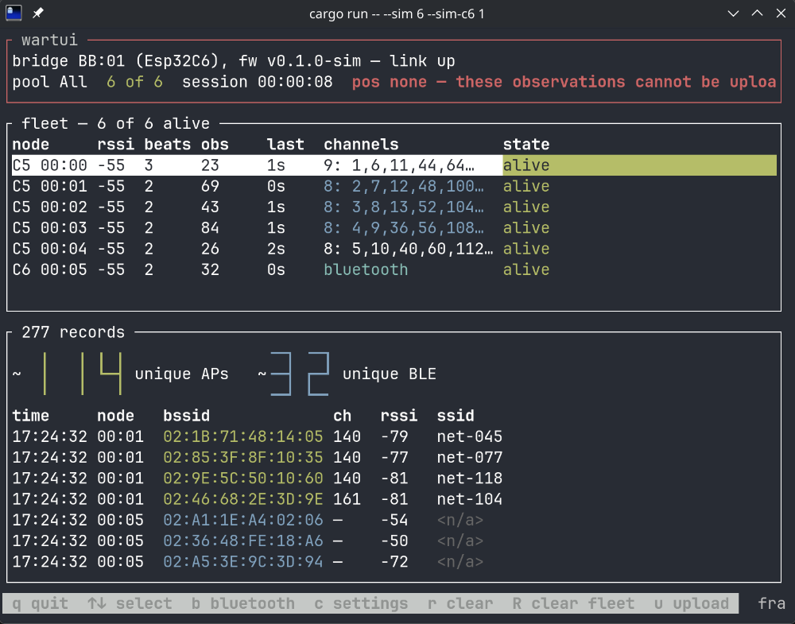

# wartui

A terminal-based fleet controller for ESP32-C5 and ESP32-C6 wardriving nodes.



The nodes talk [ESP-NOW](https://www.espressif.com/en/solutions/low-power-solutions/esp-now), which
most laptops can't. wartui uses a USB-attached ESP32 as a radio bridge. It tracks the nodes, assigns
their channels, and stores everything they see.

The nodes run `firmware/node` and the bridge runs `firmware/bridge`, both in this repository. Either
can be a C5 or a C6, but only the C5 supports 5 GHz. The bridge stays on 2.4 GHz channel 6 for
control messages, so it never needs 5 GHz. C6 support exists because I had both on hand and the
firmware toolchain is the same.

## History

**tl;dr - the initial ESP32 firmware and wire format is from JustCallMeKoko's
[ESP32DualBandWardriver](https://github.com/justcallmekoko/ESP32DualBandWardriver) project. Support
his work by [buying real hardware](https://justcallmekokollc.com/)!**

After purchasing a C5 Wardriver from JustCallMeKoko, I started looking into its open firmware. I had
some ideas around reducing interference between nodes by reducing the tx power, and what started
with some lightly modified firmware ended up as an entirely separate project.

I wanted a way to motivate myself to relearn Rust, and a fun little TUI sounded like just the
ticket. I hope you enjoy what I've built, modify it, and share with others!

## Running it

### Simulated

No hardware needed. The simulator runs a fake fleet on a fake clock:

```sh
cargo run -p wartui -- --sim 3 --lat 37.7749 --lon -122.4194
```

The simulated nodes behave like the firmware: they idle until assigned, ignore a repeated
assignment, dedup what they see, and heartbeat every 5 seconds once assigned.
`--sim-c6 N` makes the last N nodes C6s, for testing a mixed fleet without the hardware.

### On real hardware

Install the binary:

```sh
cargo install --path crates/wartui
```

With a bridge plugged in, start a capture and export it. `run` is the default subcommand, so it can
be omitted.

```sh
wartui run --lat 37.7749 --lon -122.4194   # captures to wartui-2026-10-01-21-30-15.db
wartui export                              # writes wartui-2026-10-01-21-30-15.csv beside it
wartui upload                              # sends it to WDGWars, after confirming
```

Each run creates a new `wartui-YYYY-MM-DD-HH-MM-SS.db` in the working directory, named for the
second it started. A capture holds one run, so `run` refuses a `--db` that exists. `export` reads the
newest one; pass `--db` to pick another.

`q` stops a capture and commits the last batch. The database is the record; `export` can rebuild
the CSV at any time, even while a capture is still running.

```sh
wartui ports      # list attached boards and their addresses
wartui status     # check the link and count dropped frames
wartui sniff      # decode every frame the fleet sends
wartui reset      # reboot an unresponsive bridge
wartui analyze    # summarise a capture and what it lost
```

## Subprojects

| Path                                                     | What it is                                                                                                    |
|----------------------------------------------------------|---------------------------------------------------------------------------------------------------------------|
| [`crates/wartui`](crates/wartui/README.md)               | The CLI and the [ratatui](https://ratatui.rs/) UI — **view the linked README for the full operator's manual** |
| `crates/wartui-core`                                     | Headless fleet engine, SQLite store, position, WiGLE export                                                   |
| `crates/wartui-bridge`                                   | Host-side link to the bridge: transport, the host's serial ports, simulator                                   |
| `crates/wartui-proto`                                    | `no_std` wire formats and parsers, shared with both firmwares                                                 |
| [`firmware/bridge`](firmware/bridge/README.md)           | The bridge: COBS framing and `esp-radio` calls, no protocol knowledge                                         |
| [`firmware/node`](firmware/node/README.md)               | The nodes: sniffs, reports, takes assignments                                                                 |
| [`tools/espnow-sniffer`](tools/espnow-sniffer/README.md) | Passive Arduino sniffer for bring-up and frame capture                                                        |
| `tools/beacons`                                          | Turns a monitor-mode capture into fixtures for the beacon parser                                              |
| `tools/render.py`                                        | Renders the running view as text, for a diff or an agent                                                      |

Each firmware is its own Cargo workspace, with its own target, toolchain pin, and lockfile. Both
depend on `crates/wartui-proto`, which keeps the two ends of the wire in step. The library crates
have no README; their `//!` module docs hold the detail.

## Keyboard commands

| Key                    | What it does                                                                 |
|------------------------|------------------------------------------------------------------------------|
| `↑` `↓` / `k` `j`      | Move the cursor through the fleet table                                      |
| `b`                    | Toggle Bluetooth scanning on the selected node                               |
| `c`                    | Open config (settings)                                                       |
| `r` / `R`              | Clear the selected node's dedup ring, or every assignable node's             |
| `q` / `Esc` / `ctrl-c` | Stop, committing the last batch                                              |

### In settings (`c`)

| Key               | What it does                                                       |
|-------------------|--------------------------------------------------------------------|
| `↑` `↓` / `k` `j` | Move between rows                                                  |
| `←` `→` / `h` `l` | Change the selected row; values wrap at their ends                 |
| Type / paste      | On the `wdgwars` row: enter the key (`Backspace`, `ctrl-u` clears) |
| `Enter`           | Apply every row and save it to `wartui.toml`                       |
| `Esc` / `q`       | Close without changing anything                                    |
| `ctrl-c`          | Quit                                                               |

wartui splits the channel pool across the fleet and re-splits it whenever the fleet changes. That
is the reason it exists. No key or flag assigns channels to a node. `b` only picks which node scans
Bluetooth; the planner then shares that node's channels among the rest.

A node listens for assignments only during the 100 ms after each heartbeat. Heartbeats come every
5 seconds, so a new assignment can take up to that long to land. Until then, the node's `channels`
column reads `1: 1…`.

Set the pool with the `pool` key in `wartui.toml` or from settings (`c`):

- `all` (default): every channel a node can tune, 2.4 GHz 1–13 and all of 5 GHz
- `us`: 2.4 GHz 1–11 and 5 GHz 36–165
- `eu`: 2.4 GHz 1–13 and 5 GHz 36–140

At most one node scans Bluetooth, and none does by default. That node scans back to back, does no
Wi-Fi, and its `channels` column reads `bluetooth`.

**Fleet states, GPS, channel-pool detail, and troubleshooting are in
[`crates/wartui/README.md`](crates/wartui/README.md).**

## Limits

- **Maximum twenty nodes** (`plan::MAX_NODES`), the ESP-NOW peer limit. More is unsupported.
- **The Bluetooth node sniffs no Wi-Fi.** A one-node fleet scanning Bluetooth captures no Wi-Fi,
  and the footer says so.
- **An ESP32-C6 is never assigned a 5 GHz channel.** Its radio is 2.4 GHz only.
- **Channel 14 is never scanned**, because `esp-radio` can't tune it. It's Japan-only 802.11b, so
  this should rarely matter.
- **ESP-NOW is plaintext** in both directions, with no pairing and no key.
- **Every radio transmits at 2 dBm by default.** The fleet is meant to ride in one vehicle with its
  bridge, and a node much farther away loses heartbeats first. Set node and bridge power separately
  with `[tx-power]` in `wartui.toml` or from settings (`c`); no reflash needed.
- **No compatibility with earlier versions until 1.0.** Build the host and flash every board from
  the same tree. The bridge ignores the wire format, but a host and bridge from different trees
  will not talk at all.

## Development

```sh
cargo test --workspace
cargo clippy --workspace --all-targets
cargo fmt --check

cargo test -p wartui-core --test engine                     # one test binary
cargo test -p wartui-core --test engine engine_ignores_     # tests by name prefix

cd firmware/bridge && cargo clippy --release --features esp32c6   # and esp32c5
cd firmware/node   && cargo clippy --release --features esp32c6   # and esp32c5
```

`wartui-proto` is `no_std` so both firmwares can use it. That's also why the node's beacon parser,
dedup ring, and HCI packets live there: `cargo test` covers them, and a fix needs no reflash.
`crates/wartui-proto/tests/wire.rs` pins the wire format byte-for-byte against hand-written
vectors, since there is no second implementation to check against.

Use `--log-file` to see transport logs. The view owns the terminal, so without it nothing is
logged.

### Suggested tools

There are two ways to see what the view draws:

- **ratatui's `TestBackend`** draws one frame from a hand-built `Snapshot` and returns the text.
  The tests in `crates/wartui/src/tui.rs` use it. It is fast, deterministic, and committed, so reach
  for it first. It does not run the event loop, terminal setup, or simulator.
- **[pyte](https://github.com/selectel/pyte)** is a headless VT100 emulator. `tools/render.py` runs
  the real binary on a pty at a chosen size and prints pyte's screen. This covers what `TestBackend`
  can't: the live loop, the layout at a real width, and color.

```sh
sudo dnf install python3-pyte    # or pip install pyte

python3 tools/render.py --cols 120 --rows 30    # wide layout: fleet beside the stream
python3 tools/render.py --cols 80 --rows 24     # narrow layout: stacked
python3 tools/render.py --keys jb --attrs       # press two keys first, then list what is drawn in color
python3 tools/render.py --bridge --keys b       # the attached fleet instead of the simulator
```

The output is text, so it diffs, greps, and is readable by a coding agent without an image.
`--keys` presses keys before the screen is read. The capture goes to a temporary database, deleted
on exit, unless `--db` names one to keep.

`--bridge` renders the attached boards instead of the simulator, optionally naming which one is
the bridge. Real nodes take an assignment in the window after a heartbeat and confirm it on the next, so
`--after` and `--settle` default to much longer waits than the simulator. Read any sooner, an assignment still in flight
shows as pending.
